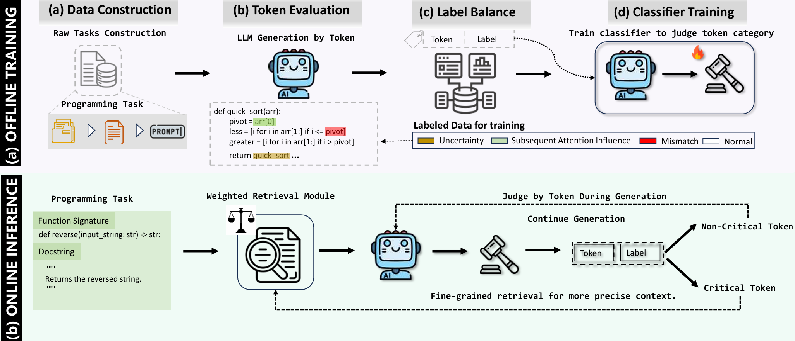

# ACToR

# [](https://github.com/Akshay090/svg-banners)

**ACToR** is an **Adaptive Critical Token-aware Retrieval** framework designed for **repository-level code generation** tasks.  

## 🎯 Overview



---

## 📁 Project Structure

```
ACToR/
├── README.md                # Project documentation
├── classifiers/             # Critical Token classifiers 
├── weights/                 # Position-aware weights
├── datasets/                # Benchmarks and training datasets
├── repositories/            # Code repositories for training and testing
└── src/                     # Source code directory
    ├── pipeline.py
    ├── critoken.py
    ├── train.py
    ├── data/                # Data processing pipeline
    │   ├── __init__.py
    │   ├── repo.py
    │   ├── task.py
    │   └── process/         # Data processing modules
    │       ├── __init__.py
    │       ├── data.py
    │       ├── window.py
    │       ├── vector.py
    │       ├── search.py
    │       ├── prompt.py
    │       └── utils.py
    └── server/              # Model server integration
        ├── __init__.py
        ├── classifier.py
        └── llm.py
```

---

## 🛠️ Quick Start

### 1. Prerequisites & Installation

**Requirements:**
- Python 3.12.11 (recommended)

**Installation:**
```bash
pip install -r requirements.txt
```

### 2. Repository Setup

Organize code repositories in the `repositories/` directory following this structure:

```bash
repositories/
├── codereval/
│   └── python/              # CoderEval Python repositories
├── repoexec/
│   └── test-app/            # RepoExec test repositories
└── repost/
    └── train/               # RepoST training repositories
```

**Setup Instructions:**

1. **[CoderEval](https://github.com/CoderEval/CoderEval)**: Clone CoderEval Python repositories to `repositories/codereval/python/`
2. **[RepoExec](https://github.com/FSoft-AI4Code/RepoExec)**: Clone RepoExec test repositories to `repositories/repoexec/test-app/`
3. **[RepoST](https://github.com/yiqingxyq/RepoST)**: Clone RepoST training repositories to `repositories/repost/train/` (for training reproduction)

> **Note**: More Details are available in `src/data/process/utils.py`

## ⚡ Usage

1. Repo Context Prep

```bash
python src/pipeline.py repo --benchmark 'repoexec' # alternative 'codereval-python', 'repost_train'
```

2. (Optional) Training Data Prep

```bash
python src/pipeline.py train --task_type 'data' --model_name 'model_name' # e.g. codellama-7b-hf
```

3. (Optional) Classifier Training

```bash
python src/pipeline.py train --task_type 'classifier' --model_name 'model_name' # e.g. codellama-7b-hf
```

4. Run Adaptive Critical Token-aware Retrieval augmented generation.

```bash
python src/pipeline.py task token --model_name 'model_name' --benchmark 'repoexec'
```